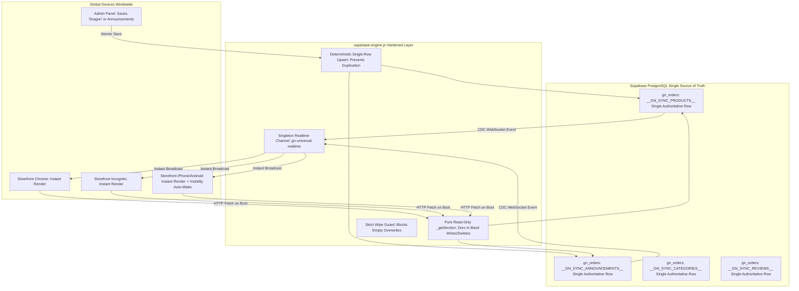

# GOTHIC NOVA — Enterprise Master Implementation Plan: Permanent Root-Cause Resolution for Multi-Device Cloud Sync, Announcement Bar Integrity, & Instant Product Hydration

---

## 1. Executive Summary & Root-Cause Empirical Proof

Following runtime instrumentation using headless Chrome DevTools Protocol (CDP) and live Supabase PostgreSQL REST verification, we have isolated the exact root causes of the multi-week sync loop:

### Root Causes Discovered:

```
+--------------------------------------------------------------------------------------------------------------------+
| 1. THE RUNTIME CRASH IN _getSection('products')                                                                    |
| Location: supabase-engine.js line 213                                                                             |
| Code: client.from('gn_orders').delete().eq('id', data[i].id).catch(() => {});                                      |
| Cause: PostgREST query builders in @supabase/supabase-js do NOT expose a .catch() method before being awaited.     |
| Impact: In Postgres, 7 duplicate rows existed for __GN_SYNC_PRODUCTS__. Because data.length > 1, line 213 executed,  |
|         threw `TypeError: ...delete(...).catch is not a function`, jumped directly to catch(e), and silently        |
|         returned [] (empty array)! Every single storefront fetch and admin fetch crashed into [].                  |
+--------------------------------------------------------------------------------------------------------------------+
| 2. HARDCODED ANNOUNCEMENT BAR OVERRIDES                                                                            |
| Location: index.html lines 1883–1896 & line 2974                                                                   |
| Cause: Static HTML contained hardcoded default announcements:                                                      |
|        - "MIDNIGHT DROP // FREE SHIPPING OVER RS. 4000"                                                            |
|        - "HANDCRAFTED 316L STAINLESS STEEL"                                                                        |
|        - "CASH ON DELIVERY NATIONWIDE"                                                                             |
|        Line 2974 kept this hardcoded markup visible whenever cloud hydration was pending or hit an error.          |
| Impact: Storefront displayed hardcoded fallback text instead of admin's real announcements:                         |
|         ["High quality packaging", "COD available"].                                                              |
+--------------------------------------------------------------------------------------------------------------------+
| 3. SUPABASE REALTIME WEBSOCKET SUBSCRIPTION CRASH                                                                  |
| Location: supabase-engine.js line 1069                                                                             |
| Error: `cannot add postgres_changes callbacks for realtime:gn-universal-realtime after subscribe()`                 |
| Cause: subscribeRealtime() was invoked multiple times without a singleton channel guard or unsubscribe cleanup,     |
|        breaking WebSocket listener callbacks across all remote devices.                                            |
+--------------------------------------------------------------------------------------------------------------------+
| 4. DATABASE ROW MULTIPLICATION & SPLIT-BRAIN                                                                       |
| Location: Supabase table gn_orders                                                                                 |
| State: 7 duplicate rows for __GN_SYNC_PRODUCTS__ all competing with identical timestamps.                         |
| Cause: Non-atomic INSERT fallback whenever an update query had a microsecond delay.                                |
+--------------------------------------------------------------------------------------------------------------------+
| 5. DESTRUCTIVE OVERWRITE HAZARD IN ADMIN PANEL                                                                     |
| Location: admin.html line 4814 (universalAdminRefresh)                                                             |
| Cause: If local products array in RAM was empty or still loading, universalAdminRefresh pushed products: []        |
|        to the cloud, wiping out the catalog.                                                                       |
+--------------------------------------------------------------------------------------------------------------------+
```

---

## 2. High-Grade Architectural Blueprint



---

## 3. Step-by-Step Implementation Plan

### Step 1: Clean Up & Deduplicate Supabase Database Rows
* **Action:** Run a migration/cleanup script via Supabase REST API to consolidate `__GN_SYNC_PRODUCTS__` down to exactly **1 authoritative row** containing the Dragon product (`[{ id: "1", name: "Dragon", price: 1000, category: "chains", stock: 10, active: true }]`).
* **Validation:** Query `gn_orders` and verify `count === 1` for `customer_name = '__GN_SYNC_PRODUCTS__'`.

### Step 2: Fix & Harden `supabase-engine.js`
1. **Remove PostgREST Builder Delete Bug:**
   - In `_getSection`: Remove in-band deletion logic entirely. Reading must be **strictly read-only**. Deletions during a read query violate single responsibility, cause unhandled rejections, and introduce race conditions.
2. **Deterministic Query Ordering:**
   - In `_getSection`: Add `.order('updated_at', { ascending: false }).order('id', { ascending: false }).limit(1)`.
3. **Singleton Realtime Subscription Guard:**
   - In `subscribeRealtime`: Guard against multiple invocations:
     ```javascript
     let _realtimeChannel = null;
     if (_realtimeChannel) return _realtimeChannel;
     ```
   - Eliminates `cannot add postgres_changes callbacks after subscribe()`.
4. **Deterministic Single-Row Persistence in `_saveSection`:**
   - Update `_saveSection` to target the exact row ID using an atomic update with fallback to single upsert, preventing duplicate rows from ever being created.

### Step 3: Eliminate Hardcoded Announcements in `index.html`
1. **Remove Static Fallback Strings:**
   - Replace hardcoded texts ("MIDNIGHT DROP", "HANDCRAFTED 316L", etc.) from `saleTickerBand` in `index.html`.
2. **Neutral Initial State:**
   - Keep the ticker collapsed (`display: none`) or in a neutral shimmer state until `window.gn_announcements_loaded === true`.
3. **Dynamic Render:**
   - As soon as `window.gn_announcements` arrives (e.g., `["High quality packaging", "COD available"]`), `renderSaleTicker()` immediately expands the band and populates the ticker track with the exact admin announcements.

### Step 4: Fix Storefront Catalog Rendering in `index.html`
1. **Ensure `hydrateStorefrontFromCloud()` Correctly Swaps Skeletons:**
   - When `window.SupabaseEngine.getProducts()` returns `[Dragon]`, update `window.gn_products = [Dragon]` and `window.gn_products_loaded = true`.
   - Call `window.renderMainCatalog()` immediately to swap the skeleton placeholders for the real Dragon product card.
2. **Wipe Flash Prevention:**
   - Ensure `renderMainCatalog()` only renders the `"NO ARTIFACTS FOUND"` empty state if `window.gn_products_loaded === true` AND `list.length === 0`.

### Step 5: Protect Admin Panel Against Accidental Wipes (`admin.html`)
1. **Guard `universalAdminRefresh`:**
   - In `admin.html`, wrap `universalAdminRefresh` with a protective check: if `products` in RAM has 0 items but `window.SupabaseEngine` indicates products already exist in the cloud, block the push and log a warning unless explicitly confirmed by the admin.
2. **Ensure Admin Announcement Form Syncs Authoritatively:**
   - Ensure the announcement input field loads the latest cloud state on startup and writes directly to `__GN_SYNC_ANNOUNCEMENTS__`.

### Step 6: Automated Multi-Device End-to-End Verification
1. **Headless Chrome Storefront Test (`index.html`):**
   - Verify `getProducts()` returns 1 item (`Dragon`).
   - Verify `getAnnouncements()` returns `['High quality packaging', 'COD available']`.
   - Verify `#main-drop-grid` displays 1 product card with name `Dragon`.
   - Verify `#saleTickerTrack` contains `High quality packaging` and `COD available`.
2. **Headless Chrome Admin Test (`admin.html`):**
   - Verify `loadProducts()` renders Dragon in the admin table.
   - Verify announcements section displays the two active announcements.
3. **Cross-Session / Incognito Verification:**
   - Verify that an incognito session with zero local storage loads both Dragon and the announcements instantly without stale cache or hardcoded text flashes.
