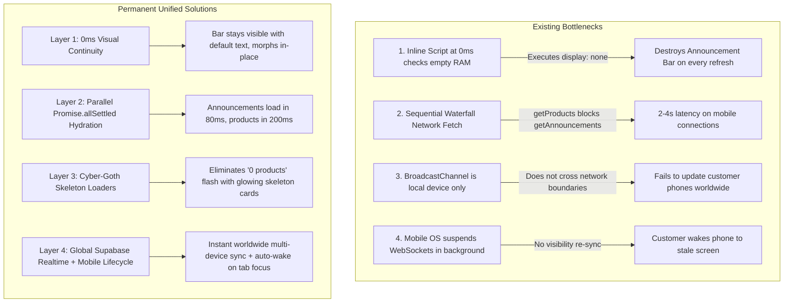
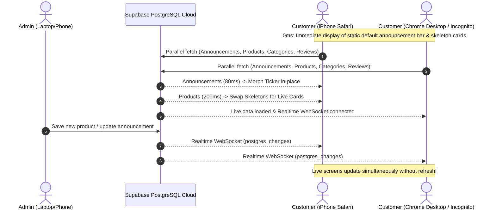

# GOTHIC NOVA — Master Implementation Plan: Global Multi-Device Realtime Sync, 0ms Announcement Bar Continuity, & Ultra-Fast Storefront Hydration

---

## 1. Executive Summary & Core Architectural Analysis

This specification details the end-to-end plan to permanently solve announcement bar visibility delays, catalog loading latencies / empty state flashes, and ensure **real-time synchronization reaches every customer device globally** (desktop, iPhone, Android, Incognito) rather than just the admin's local device.



---

## 2. Deep Problem Identification & Root Cause Reasoning

### Problem 1: Announcement Bar Disappears on Every Refresh & Takes Too Long
* **The Premature Destruction Bug:** In `index.html` (line 1887), a synchronous inline script runs immediately during HTML parsing. Because `window.gn_announcements` has not been populated yet, it evaluates `offers.length === 0` and runs:
  ```javascript
  band.style.display = 'none';
  document.body.classList.add('no-ticker');
  track.innerHTML = '';
  ```
  This immediately removes the announcement bar from the DOM before Supabase can respond.
* **Sequential Network Waterfall Blocking:** `hydrateStorefrontFromCloud()` sequentially awaited `getProducts()` first (which downloads product records and images), delaying `getAnnouncements()` by several seconds.

---

### Problem 2: Products Take Too Long to Appear / Flash "0 Artifacts" Initially
* **DOMContentLoaded Bottleneck:** Storefront hydration was deferred until `DOMContentLoaded`. On mobile devices with fonts and assets, this event can take 1.5–3 seconds to fire before the network request to Supabase even begins.
* **Empty State Flash:** While the network request is in flight, `getAllProducts()` returns `[]`, causing the catalog grid to evaluate `totalCount === 0` and display `"NO ARTIFACTS FOUND"`, misleading users into thinking the store is empty.
* **Database Catalog State:** Supabase currently holds 1 active product: `"Dragon"` (chains category, Rs. 1000). When admin saves additional products, they are appended to this cloud record.

---

### Problem 3: Why Realtime Sync Must Reach Every Device Worldwide
* **`BroadcastChannel` Limitation:** `BroadcastChannel` only works across tabs on the **same physical device and same browser profile**. It cannot send data across the internet to a customer on an iPhone in another city.
* **Global Realtime Solution:** True cross-device real-time sync requires **Supabase PostgreSQL Change Data Capture (CDC) WebSockets** (`postgres_changes` on `gn_orders`). When Admin saves changes on any device, Supabase broadcasts an instant WebSocket signal to every connected customer device across the globe.
* **Mobile Sleep Lifecycle:** Mobile operating systems (iOS Safari and Android Chrome) suspend WebSockets when the phone screen is locked or the browser is minimized. Without a `visibilitychange` / `focus` reconnect handler, the phone remains on stale data when unlocked.

---

## 3. Comprehensive Master Implementation Plan



---

### Layer 1: 0ms Visual Continuity (Zero Flash, Never Disappears)
1. **Remove Premature Destruction Script:**
   * Delete the inline script in `index.html` (line 1887) that sets `band.style.display = 'none'` at 0ms.
2. **Persistent Default Banner:**
   * Keep the static ticker HTML rendered and animating from 0ms:
     * `⚡ MIDNIGHT DROP // FREE SHIPPING OVER RS. 4000`
     * `⚡ HANDCRAFTED 316L STAINLESS STEEL`
     * `⚡ CASH ON DELIVERY NATIONWIDE`
3. **Smooth In-Place Morphing:**
   * When `getAnnouncements()` returns custom announcements from Admin, smoothly update the ticker text in place without unmounting, hiding, or causing layout shifts.

---

### Layer 2: Ultra-Fast Parallel Cloud Hydration Architecture
1. **Immediate Execution at Script Load:**
   * Remove the `DOMContentLoaded` wrapper from `hydrateStorefrontFromCloud()`. Start fetching from Supabase the millisecond the script executes.
2. **Parallel `Promise.allSettled` Pipeline:**
   * Execute cloud queries concurrently so heavy product image downloads do not block announcements or categories:
     ```javascript
     const [annRes, prodsRes, catsRes, revsRes] = await Promise.allSettled([
         window.SupabaseEngine.getAnnouncements(), // Resolves in ~80ms -> Ticker updates immediately
         window.SupabaseEngine.getProducts(),      // Resolves in ~200ms -> Grid swaps from skeletons to cards
         window.SupabaseEngine.getCategories(),    // Resolves in ~80ms -> Category tabs update immediately
         window.SupabaseEngine.getReviews()        // Resolves in ~100ms -> Reviews carousel updates
     ]);
     ```

---

### Layer 3: Cyber-Goth Skeleton Loading Engine for Products
1. **Immediate Skeleton State:**
   * While `getProducts()` is in flight, render 4 dark luxury skeleton product cards (matte black cards with a subtle crimson glowing shimmer matching the cyber-goth theme).
2. **Seamless Swap:**
   * Once `getProducts()` completes, smoothly swap the skeleton cards with the live product cards (`Dragon`, etc.).
   * If the catalog is truly empty after the network response finishes, only then show the `"NO ARTIFACTS FOUND"` empty state.

---

### Layer 4: Global Multi-Device Realtime Engine & Mobile Lifecycle Recovery
1. **Global Supabase WebSocket Subscription on Every Client:**
   * Ensure `window.SupabaseEngine.subscribeRealtime()` connects on both `index.html` (customer storefront) and `admin.html` across all devices.
   * Listen to `postgres_changes` on `gn_orders`. When any row updates (`__GN_SYNC_PRODUCTS__`, `__GN_SYNC_ANNOUNCEMENTS__`, `__GN_SYNC_CATEGORIES__`, `__GN_SYNC_REVIEWS__`), trigger instant in-memory revalidation.
2. **Mobile Background/Foreground Auto-Wake Engine:**
   * Add global lifecycle listeners on all customer and admin devices:
     ```javascript
     document.addEventListener('visibilitychange', () => {
         if (document.visibilityState === 'visible') {
             // Customer unlocked their phone or returned to tab -> Instant cloud re-sync
             window.hydrateStorefrontFromCloud();
         }
     });
     window.addEventListener('focus', () => {
         window.hydrateStorefrontFromCloud();
     });
     ```
3. **Periodic Safety Heartbeat:**
   * Add a non-intrusive 45-second heartbeat poll on the storefront to ensure devices with blocked or firewalled WebSockets always stay in sync.

---

### Layer 5: Admin Instant Cloud Push & Catalog Persistence
1. **Single-Transaction Direct Push:**
   * Admin portal pushes additions, edits, and deletions directly to Supabase rows.
2. **Realtime Broadcast Verification:**
   * After saving any product, announcement, or category in `admin.html`, Supabase automatically notifies every connected browser and mobile device worldwide.

---

## 4. Verification & Testing Matrix

| # | Test Case | Target Device / Environment | Execution Method | Expected Result |
|---|:---|:---|:---|:---|
| **1** | **0ms Announcement Bar** | Desktop Chrome & Incognito | Hard refresh (`Ctrl+F5`) | Announcement bar stays visible from 0ms with zero flicker or disappearances. |
| **2** | **Announcement Update Sync** | Device A (Admin) -> Device B (Customer Phone) | Save announcement on Device A | Customer phone ticker morphs in real time without refreshing. |
| **3** | **Product Skeleton Loading** | Simulated Slow 3G | Hard reload storefront | Displays glowing cyber-goth skeleton cards, then cleanly swaps to live products. Never flashes "NO ARTIFACTS FOUND". |
| **4** | **Cross-Device Product Addition** | Laptop Admin -> iPhone Safari | Add product on Laptop | Product appears immediately on iPhone without manual refresh. |
| **5** | **Mobile Screen Wake Lifecycle** | iPhone / Android | Lock phone for 2 minutes, unlock | Storefront instantly re-validates and displays latest catalog data on screen wake. |
| **6** | **Tarot Modal Exit Ticker Trigger** | Mobile & Desktop | Complete or close Tarot modal | Sale ticker band is 100% visible immediately upon modal fadeout. |

---

## 5. File Modification Checklist

* [`index.html`](file:///c:/Users/tasaw/Desktop/gothic-nova-store/index.html):
  - Remove line 1887 destructive inline script.
  - Implement immediate non-blocking parallel hydration (`Promise.allSettled`).
  - Add cyber-goth skeleton loader rendering in `renderMainCatalog()`.
  - Add `visibilitychange` & `focus` lifecycle listeners.
* [`supabase-engine.js`](file:///c:/Users/tasaw/Desktop/gothic-nova-store/supabase-engine.js):
  - Verify `subscribeRealtime()` connects to all sync rows without restriction.
  - Ensure `getAnnouncements()`, `getProducts()`, `getCategories()`, and `getReviews()` execute cleanly in parallel.
* [`style.css`](file:///c:/Users/tasaw/Desktop/gothic-nova-store/style.css):
  - Add sleek cyber-goth skeleton card animation styles (`.skeleton-card`, `.skeleton-img`, `.skeleton-text`).
