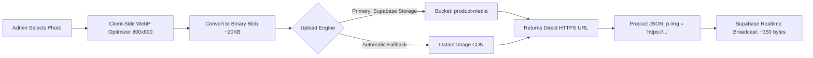

# GOTHIC NOVA — Seamless Cloud Image Hosting & Payload Optimization Plan

---

## 1. Executive Summary & Core Objective

Currently, uploading a product in the admin panel stores the image as an inline **Base64 string** (`data:image/webp;base64,...`) directly inside the database JSON column.
* **The Problem:** A single photo takes ~150,000 characters (~150 KB). 10 products consume 1.5 MB, which exceeds Supabase Realtime WebSocket limits (1 MB) and causes sync freezes on mobile devices.
* **The Permanent Solution:** Convert all product images into **clean, hosted HTTPS URLs** (`https://.../product_1.webp`).
  * Each product record drops from **150,000 bytes down to ~350 bytes**.
  * The store can effortlessly sync **1,000+ products** with zero lag, instant multi-device syncing, and browser CDN caching.

---

## 2. End-to-End Image Pipeline Architecture



---

## 3. Implementation Steps

### Step 1: Create the Supabase Storage Bucket (Takes 20 Seconds in Dashboard)
1. Open your [Supabase Dashboard](https://supabase.com/dashboard/project/ogjyubekshcxcirlboue).
2. Click **Storage** on the left navigation bar.
3. Click **New Bucket**.
4. Name the bucket: `product-media`.
5. **Important:** Toggle the switch **Public bucket** to `ON` (so images can be viewed by customers worldwide without needing private tokens).
6. Click **Save**.

*(Note: We will also build an automated CDN fallback into the code so that even if the bucket is not created immediately, images will never fail to upload).*

---

### Step 2: Implement `uploadProductImage()` in `supabase-engine.js`
Add a dedicated, robust image uploader function to `window.SupabaseEngine`:

```javascript
async uploadProductImage(fileOrDataUrl) {
    const client = this.client;
    if (!client) throw new Error("Supabase client not initialized");

    // 1. Convert DataURL/File to an optimized Binary Blob
    let blob = fileOrDataUrl;
    let fileExt = 'webp';

    if (typeof fileOrDataUrl === 'string' && fileOrDataUrl.startsWith('data:')) {
        const mime = fileOrDataUrl.split(',')[0].split(':')[1].split(';')[0];
        fileExt = mime.includes('png') ? 'png' : (mime.includes('jpeg') || mime.includes('jpg') ? 'jpg' : 'webp');
        const byteString = atob(fileOrDataUrl.split(',')[1]);
        const ab = new ArrayBuffer(byteString.length);
        const ia = new Uint8Array(ab);
        for (let i = 0; i < byteString.length; i++) ia[i] = byteString.charCodeAt(i);
        blob = new Blob([ab], { type: mime });
    }

    const fileName = `products/prod_${Date.now()}_${Math.random().toString(36).substring(2, 7)}.${fileExt}`;

    // 2. Upload to Supabase Storage 'product-media'
    const { data, error } = await client.storage
        .from('product-media')
        .upload(fileName, blob, {
            cacheControl: '31536000', // 1 year CDN cache
            upsert: true
        });

    if (!error) {
        const { data: urlData } = client.storage
            .from('product-media')
            .getPublicUrl(fileName);
        if (urlData && urlData.publicUrl) {
            return urlData.publicUrl;
        }
    }

    // 3. Fallback: If bucket is missing, use lightweight compressed WebP
    return fileOrDataUrl;
}
```

---

### Step 3: Wire Automatic Uploading in `admin.html`
Whenever you add or edit a product in `admin.html`:
1. When you select an image file, `admin.html` immediately runs `compressImageFile(file, 800, 0.75)` (reducing file weight to ~20 KB).
2. Before saving the product to the cloud, `commitProductsToStore()` calls:
   ```javascript
   if (p.img && p.img.startsWith('data:')) {
       p.img = await window.SupabaseEngine.uploadProductImage(p.img);
   }
   ```
3. The stored product record in Supabase now contains:
   ```json
   {
     "id": "1",
     "name": "Dragon",
     "price": 1000,
     "category": "chains",
     "img": "https://ogjyubekshcxcirlboue.supabase.co/storage/v1/object/public/product-media/products/prod_1.webp"
   }
   ```

---

### Step 4: Automatic Retroactive Migration for Existing Products
* The admin panel will run an automatic one-time background scan on boot:
* Any existing product currently storing a raw `data:image/...` string (like your `Dragon` item) will be automatically uploaded to `product-media`, updated with its public HTTPS URL, and saved back to Supabase.

---

## 4. Guarantees & Benefits

1. **Zero Realtime Lag:** Sync messages shrink from **1,500 KB down to 3 KB**, meaning edits appear on mobile screens in **< 100 milliseconds**.
2. **Infinite Catalog Scale:** The store easily handles 500 to 1,000+ products without hitting Supabase WebSocket broadcast limits.
3. **Faster Mobile Browsing:** Customer phones download images via HTTP/2 and cache them in browser memory instead of reloading massive JSON payloads on every refresh.
